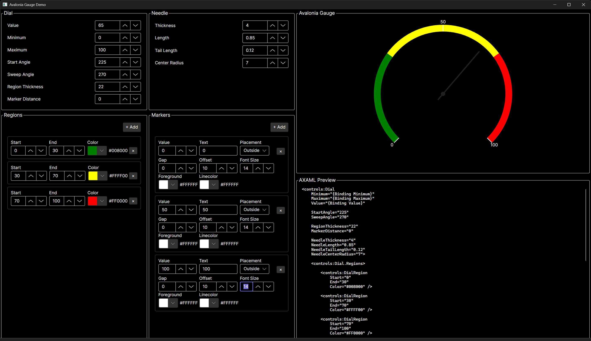

# AvaloniaGauge

A customizable, resizable gauge control for [Avalonia UI](https://avaloniaui.net/) applications.

AvaloniaGauge provides a reusable `Gauge` control with configurable value ranges, colored regions, value markers, marker positioning, typography, colors, and a customizable needle.

<p align="left">
  
</p>

## Features

* Automatically resizes to the space provided by its parent
* Configurable minimum, maximum, and current values
* Configurable start and sweep angles
* Customizable colored gauge regions
* Configurable region thickness
* Value markers
* Marker placement:

  * Inside
  * Center
  * Outside
* Marker gap and raGauge offset
* Custom marker typography
* Custom marker text colors
* Optional marker lines
* Custom marker line colors and thickness
* Configurable needle
* Configurable track brush
* MVVM-friendly property binding
* Dynamic regions and markers
* Avalonia `TemplatedControl` architecture
* Interactive demonstration application
* AXAML configuration generation in the demo

## Requirements

* .NET 10
* Avalonia UI 12.x

## Installation

Install AvaloniaGauge from NuGet:

```powershell
dotnet add package AvaloniaGauge
```

Or add the package reference directly to your project:

```xml
<PackageReference Include="AvaloniaGauge" Version="1.0.0" />
```

Replace `1.0.0` with the current published version.

## Basic Usage

Import the control namespace:

```xml
xmlns:controls="using:AvaloniaGauge.Controls"
```

A complete gauge configuration:

```xml
<controls:Gauge
    Minimum="{Binding Minimum}"
    Maximum="{Binding Maximum}"
    Value="{Binding Value}"

    StartAngle="225"
    SweepAngle="270"

    RegionThickness="22"
    MarkerDistance="0"

    NeedleThickness="4"
    NeedleLength="0.85"
    NeedleTailLength="0.12"
    NeedleCenterRadius="7">

    <controls:Gauge.Regions>

        <controls:GaugeRegion
            Start="0"
            End="30"
            Color="#008000" />

        <controls:GaugeRegion
            Start="30"
            End="70"
            Color="#FFFF00" />

        <controls:GaugeRegion
            Start="70"
            End="100"
            Color="#FF0000" />

    </controls:Gauge.Regions>

    <controls:Gauge.Markers>

        <controls:GaugeMarker
            Value="0"
            Text="0"
            Placement="Outside"
            Gap="0"
            Offset="0"
            FontSize="14" />

        <controls:GaugeMarker
            Value="50"
            Text="50"
            Placement="Outside"
            Gap="0"
            Offset="0"
            FontSize="14" />

        <controls:GaugeMarker
            Value="100"
            Text="100"
            Placement="Outside"
            Gap="0"
            Offset="0"
            FontSize="14" />

    </controls:Gauge.Markers>

</controls:Gauge>
```

### Automatic Sizing

The `Gauge` does not require an explicit `Width` or `Height`.

It automatically sizes itself based on the space provided by its parent container.

```xml
<Grid>
    <controls:Gauge
        Minimum="0"
        Maximum="100"
        Value="65" />
</Grid>
```

This allows the control to be placed into different layouts without requiring fixed dimensions.

---

## Gauge Properties

| Property             | Description                                       |
| -------------------- | ------------------------------------------------- |
| `Minimum`            | Minimum value represented by the gauge            |
| `Maximum`            | Maximum value represented by the gauge            |
| `Value`              | Current gauge value                               |
| `StartAngle`         | Starting angle of the gauge                       |
| `SweepAngle`         | Angular range of the gauge                        |
| `RegionThickness`    | Default thickness of gauge regions                |
| `MarkerDistance`     | Default marker distance                           |
| `TrackBrush`         | Brush used for the gauge track                    |
| `NeedleBrush`        | Brush used for the needle                         |
| `NeedleThickness`    | Needle thickness                                  |
| `NeedleLength`       | Needle length as a proportion of the gauge radius |
| `NeedleTailLength`   | Needle length extending behind the center         |
| `NeedleCenterRadius` | Radius of the needle center                       |

### Angles

`StartAngle` controls where the gauge begins.

`SweepAngle` controls how much of the circular path is used.

For example:

```xml
<controls:Gauge
    StartAngle="225"
    SweepAngle="270" />
```

creates a 270-degree gauge beginning at 225 degrees.

---

## Regions

Regions divide the gauge into colored value ranges.

```xml
<controls:Gauge.Regions>

    <controls:GaugeRegion
        Start="0"
        End="30"
        Color="#008000" />

    <controls:GaugeRegion
        Start="30"
        End="70"
        Color="#FFFF00" />

    <controls:GaugeRegion
        Start="70"
        End="100"
        Color="#FF0000" />

</controls:Gauge.Regions>
```

Each `GaugeRegion` specifies:

| Property    | Description                        |
| ----------- | ---------------------------------- |
| `Start`     | Starting value of the region       |
| `End`       | Ending value of the region         |
| `Color`     | Region color                       |
| `Thickness` | Optional region-specific thickness |

### Region Thickness

By default, a region uses the `Gauge.RegionThickness` value.

A region can override the default:

```xml
<controls:GaugeRegion
    Start="0"
    End="30"
    Color="#008000"
    Thickness="28" />
```

If `Thickness` is not specified, the Gauge's `RegionThickness` is used.

---

## Markers

Markers place text at specific values around the gauge.

```xml
<controls:Gauge.Markers>

    <controls:GaugeMarker
        Value="0"
        Text="0"
        Placement="Outside"
        Gap="0"
        Offset="0"
        FontSize="14" />

    <controls:GaugeMarker
        Value="50"
        Text="50"
        Placement="Outside"
        Gap="0"
        Offset="0"
        FontSize="14" />

    <controls:GaugeMarker
        Value="100"
        Text="100"
        Placement="Outside"
        Gap="0"
        Offset="0"
        FontSize="14" />

</controls:Gauge.Markers>
```

### Marker Properties

| Property        | Description                                      |
| --------------- | ------------------------------------------------ |
| `Value`         | Value at which the marker is positioned          |
| `Text`          | Text displayed by the marker                     |
| `Placement`     | Position relative to the gauge region            |
| `Gap`           | Distance between the marker and the gauge region |
| `Offset`        | Additional raGauge offset                         |
| `FontFamily`    | Marker font family                               |
| `FontSize`      | Marker font size                                 |
| `FontWeight`    | Marker font weight                               |
| `FontStyle`     | Marker font style                                |
| `FontStretch`   | Marker font stretch                              |
| `Foreground`    | Marker text color                                |
| `ShowLine`      | Enables the marker line                          |
| `LineThickness` | Marker line thickness                            |
| `LineBrush`     | Marker line color                                |

### Marker Placement

A marker can be positioned relative to the gauge region using `Placement`:

```xml
Placement="Inside"
```

```xml
Placement="Center"
```

```xml
Placement="Outside"
```

These positions place the marker text inside the gauge region, centered on the region, or outside the region.

### Marker Gap

`Gap` controls the distance between the marker and the gauge region.

```xml
<controls:GaugeMarker
    Value="50"
    Text="50"
    Placement="Outside"
    Gap="8" />
```

### Marker Offset

`Offset` provides an additional raGauge adjustment after placement and gap have been calculated.

```xml
<controls:GaugeMarker
    Value="50"
    Text="50"
    Placement="Outside"
    Gap="8"
    Offset="4" />
```

---

## Marker Text Styling

Markers support individual font settings and text colors.

```xml
<controls:GaugeMarker
    Value="50"
    Text="50"
    Placement="Outside"
    FontSize="16"
    FontWeight="Bold"
    Foreground="White" />
```

Supported typography properties include:

* `FontFamily`
* `FontSize`
* `FontWeight`
* `FontStyle`
* `FontStretch`
* `Foreground`

Marker-specific settings can be used to give individual markers different appearances.

---

## Marker Lines

Markers can optionally display a line through the gauge region.

```xml
<controls:GaugeMarker
    Value="50"
    Text="50"
    Placement="Outside"
    ShowLine="True"
    LineThickness="2"
    LineBrush="White" />
```

Marker lines can be independently configured for:

* Visibility
* Thickness
* Color

---

## Needle

The needle can be independently configured.

```xml
<controls:Gauge
    Value="65"
    NeedleThickness="4"
    NeedleLength="0.85"
    NeedleTailLength="0.12"
    NeedleCenterRadius="7"
    NeedleBrush="White" />
```

### Needle Length

`NeedleLength` is expressed as a proportion of the gauge radius.

```text
0.0 = no needle
1.0 = full gauge radius
```

For example:

```xml
<controls:Gauge
    NeedleLength="0.85" />
```

creates a needle extending to 85% of the available gauge radius.

### Needle Tail

`NeedleTailLength` controls the portion of the needle extending behind the center.

```xml
<controls:Gauge
    NeedleLength="0.85"
    NeedleTailLength="0.12" />
```

---

## MVVM

The primary Gauge properties can be bound directly to a view model.

```xml
<controls:Gauge
    Minimum="{Binding Minimum}"
    Maximum="{Binding Maximum}"
    Value="{Binding Value}"
    StartAngle="{Binding StartAngle}"
    SweepAngle="{Binding SweepAngle}"
    RegionThickness="{Binding RegionThickness}"
    MarkerDistance="{Binding MarkerDistance}"
    NeedleThickness="{Binding NeedleThickness}"
    NeedleLength="{Binding NeedleLength}"
    NeedleTailLength="{Binding NeedleTailLength}"
    NeedleCenterRadius="{Binding NeedleCenterRadius}" />
```

Regions and markers can also be supplied from view-model collections:

```xml
<controls:Gauge
    Regions="{Binding Regions}"
    Markers="{Binding Markers}" />
```

This allows the gauge configuration to be generated and modified dynamically at runtime.

---

## Dynamic Regions and Markers

Regions and markers are collection-based and can be added, removed, or modified at runtime.

For example, an application can maintain a collection of regions based on application-specific thresholds and update that collection as those thresholds change.

The `Gauge` responds to changes to its region and marker collections and updates its rendering accordingly.

This makes the control suitable for applications where gauge configuration is data-driven rather than fixed in AXAML.

---

## Demo Application

The repository contains an interactive demo application for configuring and exploring the gauge.

The demo provides editable sections for:

### Gauge

* Minimum
* Maximum
* Value
* Start angle
* Sweep angle
* Region thickness
* Marker distance

### Needle

* Thickness
* Length
* Tail length
* Center radius

### Regions

* Add regions
* Remove regions
* Start value
* End value
* Color
* Region thickness

### Markers

* Add markers
* Remove markers
* Value
* Text
* Placement
* Gap
* Offset
* Font size
* Text color
* Marker line settings
* Marker line color

Changes made in the editor are reflected immediately in the gauge.

The demo also generates the corresponding AXAML configuration, allowing a configuration created interactively to be copied directly into another Avalonia application.

---

## Project Structure

```text
AvaloniaGauge/
├── docs/
│   └── images/
│       └── demo.png
│
├── src/
│   └── AvaloniaGauge/
│       ├── Controls/
│       │   ├── Gauge.axaml
│       │   ├── Gauge.axaml.cs
│       │   ├── GaugePresenter.cs
│       │   ├── GaugeRegion.cs
│       │   └── GaugeMarker.cs
│       │
│       └── Themes/
│           └── Generic.axaml
│
├── demo/
│   └── AvaloniaGauge.Demo/
│       ├── ViewModels/
│       ├── Views/
│       └── App.axaml
│
├── LICENSE
└── README.md
```

The library project contains the reusable control and its Avalonia resources.

The demo project is separate from the library and provides the interactive configuration environment.

---

## Architecture

AvaloniaGauge uses Avalonia's `TemplatedControl` architecture.

`Gauge` is the public control that applications interact with.

The control's default template is provided by the library's `Themes/Generic.axaml` resource.

Rendering is handled by the control's rendering implementation rather than by application code.

Applications using AvaloniaGauge interact with the public `Gauge`, `GaugeRegion`, and `GaugeMarker` APIs and do not need to interact directly with the internal rendering implementation.

---

## Building from Source

Clone the repository:

```powershell
git clone https://github.com/alfredhunt/AvaloniaGauge.git
```

Change to the repository directory:

```powershell
cd AvaloniaGauge
```

Build the solution:

```powershell
dotnet build
```

The repository contains both the reusable control library and the demonstration application.

---

## NuGet Package

AvaloniaGauge is distributed as a NuGet package.

```xml
<PackageReference Include="AvaloniaGauge" Version="1.0.0" />
```

The NuGet package contains the reusable AvaloniaGauge control and its required Avalonia resources.

The demonstration application is not included in the package.

---

## Contributing

Issues and pull requests are welcome.

When submitting changes that affect the public control API or visual behavior, please update the demo application as appropriate so the new functionality can be demonstrated and tested.

---

## License

AvaloniaGauge is licensed under the MIT License. See [LICENSE](LICENSE) for details.
